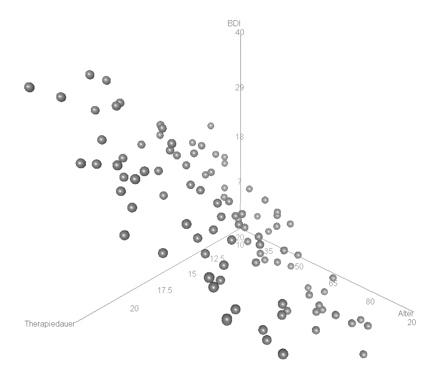
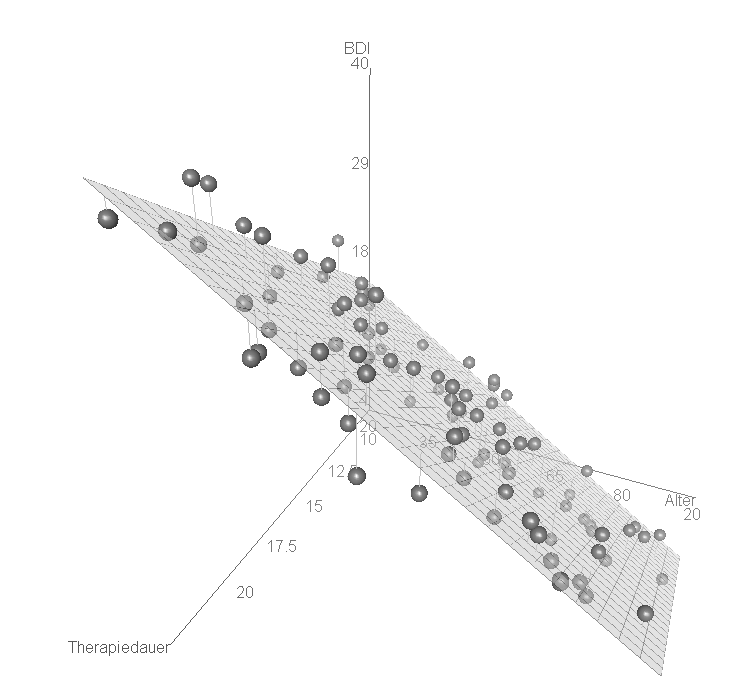

```{r, include = F}
source("12_R_common.R")
fdir        = file.path(getwd(), "12_Abbildungen")                               # Abbildungsverzeichnis
```


#  {.plain}
\center
```{r, echo = FALSE, out.width = "20%"}
knitr::include_graphics("12_Abbildungen/alm_12_otto.png")
```

\vspace{2mm}

\huge
Allgemeines Lineares Modell
\vspace{6mm}

\large
BSc Psychologie SoSe 2022

\vspace{6mm}
\normalsize
Prof. Dr. Dirk Ostwald

#
\small
\center
\footnotesize
\begin{tabular}{lll}
Datum        & Einheit                       & Thema					                \\\hline
08.04.2022   & Grundlagen                    & (1) Regression  				            \\
             & \textcolor{gray}{Osterpause}                                             \\
22.04.2022   & Grundlagen                    & (2) Korrelation               	        \\
29.04.2022   & Grundlagen                    & (3) Matrizen                             \\
06.05.2022   & Grundlagen                    & (4) Normalverteilungen                   \\
13.05.2022   & Theorie                       & (5) Modellformulierung                   \\
20.05.2022   & Theorie                       & (6) Modellschätzung                      \\
27.05.2022   & Theorie                       & (7) Modellevaluation                     \\
03.06.2021   & Anwendung                     & (8) Studiendesign                        \\
10.06.2021   & Anwendung                     & (9) T-Tests                              \\
17.06.2021   & Anwendung                     & (10) Einfaktorielle Varianzanalyse       \\
24.06.2022   & Anwendung                     & (11) Zweifaktorielle Varianzanalyse      \\
01.07.2022   & Anwendung                     & (12) Multiple Regression                 \\
11.07.2022   & Q \& A                        & Online 14 - 17 Uhr                       \\\hline
14.07.2022   & Klausur                       & G16-H5 11 - 12 Uhr                       \\
März 2023    & Klausurwiederholungstermin    &
\end{tabular}

# {.plain}
\center
\huge
\vfill
\noindent (12) Multiple Regression
\vfill

# Überblick
\vspace{2mm}
\setstretch{1.3}
\textcolor{darkblue}{Faktorielle und Parametrische ALM Designs}

\small
Faktorielle ALM Designs
\vspace{-2mm}

* Designmatrizen mit $1$en und $0$en, manchmal $-1$en.
* Betaparameter repräsentieren Gruppenerwartungswerte.
* Betaparameterschätzer repräsentieren Gruppenstichprobenmittel.
* $\Rightarrow$ T-Tests, Einfaktorielle Varianzanalyse, Mehrfaktorielle Varianzanalyse


Parametrische ALM Designs
\vspace{-2mm}

* Designmatrizen besitzen Spalten mit kontinuierlichen reellen Werten.
* Die Designmatrixsspalten werden *Regressoren*, *Prädiktoren*, oder *Kovariaten* genannt.
* Betaparameter repräsentieren Steigungsparameter.
* Betaparameterschätzer ergeben sich als normalisierte Regressor-Daten Kovarianzen.
* Es besteht ein enger Bezug zur Theorie der Korrelation.
* $\Rightarrow$ Einfache lineare Regression, Multiple lineare Regression

Faktoriell-parametrische ALM Designs
\vspace{-2mm}

* Designmatrizen mit mehreren faktoriellen und parametrischen Werten.
* Die parametrischen Regressoren werden oft als kontrollierte Kovariaten betrachtet.
* $\Rightarrow$ Kovarianzanalyse

# Überblick
\setstretch{1.6}
\textcolor{darkblue}{ALM Designs als Hypothesentestverfahren$^\ast$}

Testen von Unterschiedshypothesen

* T-Tests
* Einfaktorielle Varianzanalyse
* Mehrfaktorielle Varianzanalyse
* Kovarianzanalyse

Testen von Zusammenhangshypothesen

* Einfache lineare Regression/Korrelation
* Multiple lineare Regression/Multiple Korrelation


$^\ast$Diese Sichtweise durch den Lehrenden nicht favorisiert.

#
\large
\setstretch{2}
\vfill
Anwendungsszenario

Modellformulierung

Modellschätzung

Modellevaluation

Ausblick

Selbstkontrollfragen
\vfill

#
\large
\setstretch{2}
\vfill
**Anwendungsszenario**

Modellformulierung

Modellschätzung

Modellevaluation

Ausblick

Selbstkontrollfragen
\vfill

# Anwendungsszenario

\textcolor{darkblue}{Anwendungsszenario}

\small
* Generalisierung der einfachen linearen Regression zu mehr als einer unabhängigen Variable.
* Eine univariate abhängige Variable bestimmt an randomisierten experimentellen Einheiten.
* Zwei oder mehr "kontinuierliche" unabhängige Variablen.
* Die unabhängigen Variablen heißen Regressoren, Prädiktoren, Kovariaten oder Features.
\vspace{2mm}

\normalsize
\textcolor{darkblue}{Ziele}

\small
* Quantifizierung des Erklärungspotentials der Variation der UVs durch die Variation der AVs.
* Quantifizierung des Einflusses einzelner UVs auf die AV im Kontext anderer UVs.
* Prädiktion von AV Werten aus UV Werten nach Parameterschätzung.
\vspace{2mm}

\normalsize
\textcolor{darkblue}{Anwendungsbeispiel}

\small
* BDI Differenzwerte in Abhängigkeit von Therapiedauer und Alter


# Anwendungsszenario

\normalsize
\textcolor{darkblue}{Beispieldatensatz}

\small
$n = 100$

\footnotesize
\setstretch{1}
```{r, echo = F}
fname      = file.path(getwd(), "12_Daten", "12_Multiple_Regression_Daten.csv")
D          = read.table(fname, sep = ",", header = TRUE)         # Datensatz
knitr::kable(round(D[1:25,2:5]), "pipe")
```

#
\large
\setstretch{2}
\vfill
Anwendungsszenario

**Modellformulierung**

Modellschätzung

Modellevaluation

Ausblick

Selbstkontrollfragen
\vfill

# Modellformulierung
\footnotesize
\setstretch{1.2}
\begin{definition}[Modell der multiplen Regression]
\justifying
$y_i$ mit $i = 1,...,n$ sei die Zufallsvariable, die den $i$ten Wert einer abhängigen
Variable modelliert. Dann hat das \textit{Modell der multiplen Regression}
die strukturelle Form \begin{equation}
y_i = x_{i1}\beta_1 + \cdots + x_{ip}\beta_p + \varepsilon_i \mbox{ mit }
\varepsilon_i \sim N(0,\sigma^2) \mbox{ u.i.v. für } i = 1,...,n \mbox{ und } \sigma^2 > 0,
\end{equation}
wobei $x_{ij} \in \mathbb{R}$ mit $1 \le i \le n$ und $1 \le j \le p$ den $i$ten Wert der $j$te
unabhängigen Variable bezeichnet. Die unabhängigen Variablen werden auch
\textit{Regressoren, Prädiktoren, Kovariaten} oder \textit{Features} genannt. Mit
\begin{equation}
x_i := (x_{i1}, ..., x_{ip})^T \in \mathbb{R}^p
\mbox{ und }
\beta := (\beta_1,..., \beta_p)^T \in \mathbb{R}^p
\end{equation}
hat das Modell der multiplen Regression die Datenverteilungsform
\begin{equation}
y_i \sim N(\mu_i,\sigma^2) \mbox{ u.i.v. für } i = 1,...,n, \mbox{ wobei } \mu_i := x^T_i\beta.
\end{equation}
In diesem Zusammenhang wird $x_i \in \mathbb{R}^p$ auch als $i$ter \textit{ Featurevektor } bezeichnet.
Die Designmatrixform des Modells der multiplen Regression schließlich ist gegeben durch
\begin{equation}
y = X\beta + \varepsilon \mbox{ mit } \varepsilon \sim N(0_n,\sigma^2I_n)
\end{equation}
mit
\begin{equation}
y     := (y_1,...,y_n)^T,
X     := (x_{ij})_{1 \le i \le n, 1 \le j \le p} \in \mathbb{R}^{n \times p},
\beta := (\beta_1,...,\beta_p)^T \in \mathbb{R}^p \mbox{ und }
\sigma^2 > 0.
\end{equation}
\end{definition}
\vspace{-2mm}
Bemerkung

* Das Modell der multiplen Regression und die allgemeine Form des ALMs sind identisch.

# Modellformulierung
\vspace{2mm}
\textcolor{darkblue}{Beispieldatensatzerzeugung}
\vspace{1mm}
\tiny
\setstretch{1}

```{r, warning=FALSE}
# Datensimulation
library(MASS)                                          # Multivariate Normalverteilung
set.seed(10)                                           # reproduzierbare Daten
n             = 100                                    # Anzahl Datenpunkte
p             = 3                                      # Anzahl Parameter
x_1           = round(runif(n,20,80))                  # Regressorwerte Alter
x_2           = round(runif(n,12,24))                  # Regressorwerte Therapiedauer
X             = matrix(c(rep(1,n),x_1,x_2), nrow = n)  # Designmatrix
I_n           = diag(n)                                # Identitätsmatrix
beta          = matrix(c(5,-.5,2), nrow = p)           # Betaparametervektor
sigsqr        = 10                                     # Varianzparameter
y             = mvrnorm(1, X %*% beta, sigsqr*I_n)     # eine Realisierung eines n-dimensionalen ZVs

# Dataframeformatierung
library(writexl)                                       # Excel Output
D            = data.frame("ID" = 1:n)                  # Dataframe Initialisierung und ID Variable
D$Age        = x_1                                     # Alter
D$Therapy    = x_2                                     # Therapiedauer
D$BDI        = y                                       # PrePost-BDI Differenzwerte

# Datenspeicherung
write_xlsx(D, file.path(getwd()       , "12_Daten", "12_Multiple_Regression_Daten.xlsx"))
write.csv( D, file = file.path(getwd(), "12_Daten", "12_Multiple_Regression_Daten.csv"))
```

# Modellschätzung
\vspace{2mm}
\textcolor{darkblue}{Beispieldatenvisualisierung}
\vspace{1mm}
\tiny
\setstretch{1.2}

```{r}
# Dateneinlesen
fname      = file.path(getwd(), "12_Daten", "12_Multiple_Regression_Daten.csv")
D          = read.table(fname, sep = ",", header = TRUE)        

# Open GL Visualisierung  mit car package, siehe ?scatter3d für Details
library(car)
scatter3d(
D$Age,
D$BDI,
D$Therapy,
xlab        = "Alter",
ylab        = "BDI",
zlab        = "Therapiedauer",
point.col   = "gray40",
axis.col    = rep("black",3),
axis.scales = T,
axis.ticks  = T,
surface     = F)
```

# Modellschätzung
\vspace{2mm}
\textcolor{darkblue}{Beispieldatenvisualisierung}
\vspace{1mm}

\center
```{r, echo = FALSE, out.width = "60%"}

```

#
\large
\setstretch{2}
\vfill
Anwendungsszenario

Modellformulierung

**Modellschätzung**

Modellevaluation

Ausblick

Selbstkontrollfragen
\vfill

# Modellschätzung
\textcolor{darkblue}{Überblick}

\small
Der Betaparameterschätzer hat bekanntlich die Form
\begin{equation}
\hat{\beta} := (X^TX)^{-1}X^Ty
\end{equation}
Dabei quantifizieren in sehr grober Auflösung

* $X^Ty \in \mathbb{R}^p$ die Kovariation der Regressoren mit den Daten und
* $X^TX \in \mathbb{R}^{p \times p}$ die Kovariation der Regressoren untereinander.

Damit ergibt sich für die Betaparameterschätzer also eine Interpretation als
"regressorkovarianznormalisierte Regressordatenkovariation",
\begin{equation}
\hat{\beta} \approx \mbox{Regressorkovarianz}^{-1} \cdot \mbox{Regresssordatenkovarianz}
\end{equation}
Im Folgenden wollen wir diese Intuition am Beispiel einer einfachen multiplen
Regression mit einem Interzeptregressor und zwei unabhängigen Variablen Regressoren
vertiefen, wobei die betreffenden Kovariationen einmal durch Stichprobenkorrelationen
und einmal durch partielle Stichprobenkorrelationen quantifiziert werden sollen.

# Modellschätzung
\footnotesize
\begin{theorem}[Betaparameterschätzer und Korrelationen]
\justifying
\normalfont
Gegeben sei ein multiples Regressionsmodel der Form
\begin{equation}
y = X\beta + \varepsilon, \varepsilon \sim N(0_n,\sigma^2I_n)
\mbox{ mit }
X
:=
\begin{pmatrix}
1      & x_{11} & x_{12} \\
\vdots & \vdots & \vdots \\
1      & x_{n1} & x_{n2} \\
\end{pmatrix}
\mbox{ und }
\beta
:=
\begin{pmatrix}
\beta_0 \\
\beta_1 \\
\beta_2
\end{pmatrix}.
\end{equation}
Dann gilt
\begin{equation}
\renewcommand{\arraystretch}{1.8}
\hat{\beta}
=
\begin{pmatrix}
\bar{y} - \hat{\beta}_1\bar{x}_1 - \hat{\beta}_2\bar{x}_2                        \\
\frac{r_{y,x_1} - r_{y,x_2}r_{x_1,x_2}}{1 - r_{x_1,x_2}^2} \frac{s_{y}}{s_{x_1}} \\
\frac{r_{y,x_2} - r_{y,x_1}r_{x_1,x_2}}{1 - r_{x_1,x_2}^2} \frac{s_{y}}{s_{x_2}} \\
\end{pmatrix},
\end{equation}
wobei für die $y_i,x_{i1}$ und $x_{i2}$ mit $i = 1,...,n$ $\bar{\cdot}$, $s_{\cdot}$
und $r_{\cdot,\cdot}$ die entsprechenden Stichprobenmittel, Stichprobenstandardabweichungen,
und Stichprobenkorrelationen bezeichnen.
\end{theorem}
Bemerkung

* \justifying In Bezug auf die Regressoren sind die Begriffe Stichprobenmittel,
Stichprobenstandardabweichung, und Stichprobenkorrelation lediglich formal gemeint,
nach Voraussetzung des ALMs sind die Regressorenwerte keine Realisierungen von
Zufallsvariablen.

# Modellschätzung
\footnotesize
\underline{Beweis}

Wir erinnern zunächst daran, dass die Form des Betaparameterschätzers bekanntlich
zum System der Normalengleichungen äquivalent ist (vgl. (6) Modellschätzung),
\begin{equation}
\hat{\beta} = (X^TX)^{-1}X^Ty \Leftrightarrow X^TX\hat{\beta} = X^Ty.
\end{equation}
Ausschreiben des Normalengleichungssystems für den hier betrachteten ALM Spezialfall
ergibt dann zunächst
\tiny
\begin{align*}
\renewcommand{\arraystretch}{1.5}
\begin{split}
X^TX\hat{\beta} & = X^Ty
\\\Leftrightarrow
\begin{pmatrix}
1      & \cdots & 1      \\
x_{11} & \cdots & x_{n1} \\
x_{12} & \cdots & x_{n2} \\
\end{pmatrix}
\begin{pmatrix}
1      & x_{11} & x_{12} \\
\vdots & \vdots & \vdots \\
1      & x_{n1} & x_{n2} \\
\end{pmatrix}
\begin{pmatrix}
\hat{\beta}_0 \\
\hat{\beta}_1 \\
\hat{\beta}_2 \\
\end{pmatrix}
& =
\begin{pmatrix}
1      & \cdots & 1      \\
x_{11} & \cdots & x_{n1} \\
x_{12} & \cdots & x_{n2} \\
\end{pmatrix}
\begin{pmatrix}
y_1    \\
\vdots \\
y_n
\end{pmatrix}
\\\Leftrightarrow
\begin{pmatrix*}[l]
n                   & \sum_{i=1}^n x_{i1}       & \sum_{i=1}^n x_{i2}       \\
\sum_{i=1}^n x_{i1} & \sum_{i=1}^n x_{i1}^2     & \sum_{i=1}^n x_{i1}x_{i2} \\
\sum_{i=1}^n x_{i2} & \sum_{i=1}^n x_{i2}x_{i1} & \sum_{i=1}^n x_{i2}^2       \\
\end{pmatrix*}
\begin{pmatrix}
\hat{\beta}_0 \\
\hat{\beta}_1 \\
\hat{\beta}_2 \\
\end{pmatrix}
& =
\begin{pmatrix*}[l]
\sum_{i=1}^n y_i \\
\sum_{i=1}^n y_ix_{i1} \\
\sum_{i=1}^n y_ix_{i2} \\
\end{pmatrix*}
\\\Leftrightarrow
\begin{pmatrix*}[l]
n                   & \sum_{i=1}^n x_{i1}       & \sum_{i=1}^n x_{i2}       \\
\sum_{i=1}^n x_{i1} & \sum_{i=1}^n x_{i1}^2     & \sum_{i=1}^n x_{i1}x_{i2} \\
\sum_{i=1}^n x_{i2} & \sum_{i=1}^n x_{i2}x_{i1} & \sum_{i=1}^n x_{i2}^2       \\
\end{pmatrix*}
\begin{pmatrix}
\hat{\beta}_0 \\
\hat{\beta}_1 \\
\hat{\beta}_2 \\
\end{pmatrix}
& =
\begin{pmatrix*}[l]
\sum_{i=1}^n y_i \\
\sum_{i=1}^n y_ix_{i1} \\
\sum_{i=1}^n y_ix_{i2} \\
\end{pmatrix*}
\end{split}
\end{align*}

# Modellschätzung
\footnotesize
\underline{Beweis (fortgeführt)}

und damit
\tiny
\begin{align*}
\renewcommand{\arraystretch}{1.5}
\begin{split}
X^TX\hat{\beta}
& =
X^Ty
\\\Leftrightarrow
\begin{pmatrix*}
n\hat{\beta}_0 + \hat{\beta}_1\sum_{i=1}^n x_{i1} + \hat{\beta}_2\sum_{i=1}^n x_{i2} \\
\hat{\beta}_0 \sum_{i=1}^n x_{i1} +  \hat{\beta}_1 \sum_{i=1}^n x_{i1}^2 + \hat{\beta}_2 \sum_{i=1}^n x_{i1}x_{i2} \\
\hat{\beta}_0 \sum_{i=1}^n x_{i2} +  \hat{\beta}_1 \sum_{i=1}^n x_{i1}x_{i2} + \hat{\beta}_2 \sum_{i=1}^n x_{i2}^2
\end{pmatrix*}
& =
\begin{pmatrix*}[l]
\sum_{i=1}^n y_i \\
\sum_{i=1}^n y_ix_{i1} \\
\sum_{i=1}^n y_ix_{i2} \\
\end{pmatrix*}
\end{split}
\end{align*}
\footnotesize
Aus der Gleichung der ersten Vektorkomponenten folgt dann direkt die Form von $\hat{\beta}_0$ mit
\tiny
\begin{align}
\begin{split}
\sum_{i=1}^n y_i
& = n\hat{\beta}_0 + \hat{\beta}_1\sum_{i=1}^n x_{i1}            + \hat{\beta}_2\sum_{i=1}^n x_{i2}
\\\Leftrightarrow
\frac{1}{n}\sum_{i=1}^n y_i
& = \hat{\beta}_0  + \hat{\beta}_1\frac{1}{n}\sum_{i=1}^n x_{i1} + \hat{\beta}_2\frac{1}{n}\sum_{i=1}^n x_{i2}
\\\Leftrightarrow
\hat{\beta}_0
& = \bar{y} - \hat{\beta}_1\bar{x}_1 - \hat{\beta}_2\bar{x}_2
\end{split}
\end{align}


# Modellschätzung
\footnotesize
\underline{Beweis (fortgeführt)}

Einsetzen dieser Form von $\hat{\beta}_0$ in die Gleichung der zweiten Vektorkomponenten ergibt dann
\tiny
\begin{align*}
\begin{split}
   \hat{\beta}_0 \sum_{i=1}^n x_{i1}
+ \hat{\beta}_1 \sum_{i=1}^n x_{i1}^2
+ \hat{\beta}_2 \sum_{i=1}^n x_{i1}x_{i2}
&
= \sum_{i=1}^n y_ix_{i1}
\\
  (\bar{y} - \hat{\beta}_1\bar{x}_1 - \hat{\beta}_2\bar{x}_2) \sum_{i=1}^n x_{i1}
+ \hat{\beta}_1 \sum_{i=1}^n x_{i1}^2
+ \hat{\beta}_2 \sum_{i=1}^n x_{i1}x_{i2}
&
= \sum_{i=1}^n y_ix_{i1}
\\
  \bar{y}\sum_{i=1}^n x_{i1}
- \hat{\beta}_1\bar{x}_1\sum_{i=1}^n x_{i1}
- \hat{\beta}_2\bar{x}_2\sum_{i=1}^n x_{i1}
+ \hat{\beta}_1 \sum_{i=1}^n x_{i1}^2
+ \hat{\beta}_2 \sum_{i=1}^n x_{i1}x_{i2}
&
= \sum_{i=1}^n y_ix_{i1}
\\
  \hat{\beta}_1 \sum_{i=1}^n x_{i1}^2
- \hat{\beta}_1\bar{x}_1\sum_{i=1}^n x_{i1}
+ \hat{\beta}_2 \sum_{i=1}^n x_{i1}x_{i2}
- \hat{\beta}_2\bar{x}_2\sum_{i=1}^n x_{i1}
&
=
  \sum_{i=1}^n y_ix_{i1}
- \bar{y}\sum_{i=1}^n x_{i1}
\\
  \hat{\beta}_1 \left(\sum_{i=1}^n x_{i1}^2     - \bar{x}_1\sum_{i=1}^n x_{i1}\right)
+ \hat{\beta}_2 \left(\sum_{i=1}^n x_{i1}x_{i2} - \bar{x}_2\sum_{i=1}^n x_{i1} \right)
&
=
  \sum_{i=1}^n y_ix_{i1}
- \bar{y}\sum_{i=1}^n x_{i1}
\end{split}
\end{align*}

# Modellschätzung
\footnotesize
\underline{Beweis (fortgeführt)}

Im Beweis des Theorems zur Ausgleichsgerade (vgl. (1) Regression) haben wir gesehen, dass
\begin{align}
\begin{split}
\sum_{i=1}^n x_{i1}x_{i1} - \bar{x}_1\sum_{i=1}^n x_{i1} & = \sum_{i=1}^n (x_{i1} - \bar{x}_1)(x_{i1} - \bar{x}_1) \\
\sum_{i=1}^n x_{i1}x_{i2} - \bar{x}_2\sum_{i=1}^n x_{i1} & = \sum_{i=1}^n (x_{i1} - \bar{x}_1)(x_{i2} - \bar{x}_2) \\
\sum_{i=1}^n y_ix_{i1}    - \bar{y}  \sum_{i=1}^n x_{i1} & = \sum_{i=1}^n (y_i    - \bar{y}  )(x_{i1} - \bar{x}_1)
\end{split}
\end{align}
\footnotesize

# Modellschätzung
\footnotesize
\underline{Beweis (fortgeführt)}

Es ergibt sich also, dass
\tiny
\begin{align}
\begin{split}
  \hat{\beta}_1 \sum_{i=1}^n (x_{i1}-\bar{x}_1)(x_{i1}-\bar{x}_1)
+ \hat{\beta}_2 \sum_{i=1}^n (x_{i1}-\bar{x}_1)(x_{i2}-\bar{x}_2)
&
= \sum_{i=1}^n (y_i-\bar{y})(x_{i1}-\bar{x}_1)
\\
  \hat{\beta}_1 \frac{\sum_{i=1}^n (x_{i1}-\bar{x}_1)(x_{i1}-\bar{x}_1)}{n-1}
+ \hat{\beta}_2 \frac{\sum_{i=1}^n (x_{i1}-\bar{x}_1)(x_{i2}-\bar{x}_2)}{n-1}
&
= \frac{\sum_{i=1}^n (y_i-\bar{y})(x_{i1}-\bar{x}_1)}{n-1}
\end{split}
\end{align}
\footnotesize
Mit den Definitionen von Stichprobenstandardabweichung und -korrelation folgt dann weiter
\tiny
\begin{align}
\begin{split}
  \hat{\beta}_1  s_{x_1}s_{x_1}
+ \hat{\beta}_2c_{x_1,x_2}
&
= c_{y,x_1}
\\
  \hat{\beta}_1  \frac{s_{x_1}s_{x_1}}{s_ys_{x_1}}
+ \hat{\beta}_2  \frac{c_{x_1,x_2}}{s_ys_{x_1}}
&
= \frac{c_{y,x_1}}{s_ys_{x_1}}
\\
  \hat{\beta}_1  \frac{s_{x_1}}{s_y}
+ \hat{\beta}_2  \frac{c_{x_1,x_2}}{s_ys_{x_1}}
&
= r_{y,x_1}
\\
  \hat{\beta}_1  \frac{s_{x_1}}{s_y}
+ \hat{\beta}_2  \frac{c_{x_1,x_2}s_{x_2}}{s_ys_{x_1}s_{x_2}}
&
= r_{y,x_1}
\\
  \hat{\beta}_1  \frac{s_{x_1}}{s_y}
+ \hat{\beta}_2  \frac{s_{x_2}}{s_y}r_{x_1,x_2}
&
= r_{y,x_1}
\end{split}
\end{align}

# Modellschätzung
\footnotesize
\underline{Beweis (fortgeführt)}

Definition von
\begin{equation}\label{eq:sbeta}
b_j  := \frac{s_{x_j}}{s_{y}}, j = 1,2
\end{equation}
erlaubt dann die Schreibweise
\begin{equation}
b_1 + b_2 r_{x_1,x_2} = r_{y,x_1}.
\end{equation}
Schließlich folgt analog durch Vertauschen der Subskripte aus der Gleichung der dritten
Vektorkomponenten
\begin{equation}
b_1r_{x_1,x_2} + b_2  = r_{y,x_2}
\end{equation}
Insgesamt haben wir also gesehen, dass die Definition des Betaparameterschätzers
im vorliegenden ALM Spezialfall ergibt, dass mit
\begin{equation}\label{eq:sbeta}
\hat{\beta}_j  = b_j \frac{s_{y}}{s_{x_j}}, j = 1,2
\end{equation}
gilt, dass
\begin{align}
\begin{split}
r_{y,x_1} & = b_1 + b_2 r_{x_1,x_2} \\
r_{y,x_2} & = b_1r_{x_1,x_2} + b_2
\end{split}
\end{align}

# Modellschätzung
\footnotesize
\underline{Beweis (fortgeführt)}

Damit folgt aus der zweiten Gleichung dann sofort
\begin{equation}
b_2 = r_{y,x_2} - b_1r_{x_1,x_2}.
\end{equation}
Einsetzen in die erste Gleichung ergibt dann
\begin{align}
\begin{split}
b_1 + (r_{y,x_2} - b_1r_{x_1,x_2}) r_{x_1,x_2} & = r_{y,x_1}
\\
\Leftrightarrow
b_1 + r_{y,x_2}r_{x_1,x_2} - b_1r_{x_1,x_2}^2  & = r_{y,x_1}
\\
\Leftrightarrow
r_{y,x_2}r_{x_1,x_2} + b_1\left(1 - r_{x_1,x_2}^2\right) & = r_{y,x_1}
\\
\Leftrightarrow
b_1\left(1 - r_{x_1,x_2}^2\right) & = r_{y,x_1} -  r_{y,x_2}r_{x_1,x_2}
\\
\Leftrightarrow
b_1 & = \frac{r_{y,x_1} -  r_{y,x_2}r_{x_1,x_2}}{1 - r_{x_1,x_2}^2}
\end{split}
\end{align}

# Modellschätzung
\footnotesize
\underline{Beweis (fortgeführt)}

Für $b_2$ ergibt sich damit weiterhin
\begin{align}
\begin{split}
b_2 & = r_{y,x_2} - b_1r_{x_1,x_2}
\\
\Leftrightarrow
b_2 & = r_{y,x_2} - \left(\frac{r_{y,x_1} -  r_{y,x_2}r_{x_1,x_2}}{1 - r_{x_1,x_2}^2}\right)r_{x_1,x_2}
\\
\Leftrightarrow
b_2 & = \frac{r_{y,x_2}\left(1 - r_{x_1,x_2}^2\right)}{1 - r_{x_1,x_2}^2} - \frac{r_{y,x_1}r_{x_1,x_2} -  r_{y,x_2}r_{x_1,x_2}^2}{1 - r_{x_1,x_2}^2}
\\
\Leftrightarrow
b_2 & = \frac{r_{y,x_2} - r_{y,x_2}r_{x_1,x_2}^2 - r_{y,x_1}r_{x_1,x_2} +  r_{y,x_2}r_{x_1,x_2}^2}{1 - r_{x_1,x_2}^2}
\\
\Leftrightarrow
b_2 & = \frac{r_{y,x_2} - r_{y,x_1}r_{x_1,x_2}}{1 - r_{x_1,x_2}^2}
\end{split}
\end{align}
Damit folgen dann aber
\begin{align}
\begin{split}
\hat{\beta}_1 & = b_1 \frac{s_{y}}{s_{x_1}} = \left(\frac{r_{y,x_1} - r_{y,x_2}r_{x_1,x_2}}{1 - r_{x_1,x_2}^2} \right) \frac{s_{y}}{s_{x_1}} \\
\hat{\beta}_2 & = b_2 \frac{s_{y}}{s_{x_2}} = \left(\frac{r_{y,x_2} - r_{y,x_1}r_{x_1,x_2}}{1 - r_{x_1,x_2}^2} \right) \frac{s_{y}}{s_{x_2}} \\
\end{split}
\end{align}
und es ist alles gezeigt.
$\hfill\Box$

# Modellschätzung
\textcolor{darkblue}{Anwendungsbeispiel}
\tiny
\vspace{1mm}
\setstretch{1.2}
```{r}
# Dateneinlesen
fname      = file.path(getwd(), "12_Daten", "12_Multiple_Regression_Daten.csv")
D          = read.table(fname, sep = ",", header = TRUE)         # Datensatz

# Modellschätzung
y          = D$BDI                                               # Abhängige Variable
n          = length(y)                                           # Anzahl Datenpunkte
X          = matrix(c(rep(1,n), D$Age, D$Therapy), nrow = n)     # Desigmatrix
beta_hat   = solve(t(X) %*% X) %*% t(X) %*% y                    # Betaparameterschätzer
eps_hat    = y - X %*% beta_hat                                  # Residuenvektor
sigsqr_hat = (t(eps_hat) %*% eps_hat) /(n-p)                     # Varianzparameterschätzer

# Betaparameterschätzer aus Stichprobenmittel, -standardabweichungen und -korrelationen
y12        = cbind(y,X[,-1])                                     # y,x_1,x_2 Matrix
bars       = apply(y12, 2, mean)                                 # Stichprobenmittel
s          = apply(y12, 2, sd)                                   # Stichprobenstandardabweichungen
r          = cor(y12)                                            # Stichprobenkorrelationen
beta_hat_1 = (r[1,2] - r[1,3]*r[2,3])/(1 - r[2,3]^2)*(s[1]/s[2]) # \hat{\beta}_1
beta_hat_2 = (r[1,3] - r[1,2]*r[2,3])/(1 - r[2,3]^2)*(s[1]/s[3]) # \hat{\beta}_2
beta_hat_0 = bars[1] - beta_hat_1*bars[2] - beta_hat_2*bars[3]   # \hat{\beta}_0

# Ausgabe
cat("beta_hat ALM-Schätzer          :"  , beta_hat,
    "\nbeta_hat Deskriptivstatistiken :", c(beta_hat_0,beta_hat_1,beta_hat_2))
```


# Modellschätzung
\vspace{2mm}
\textcolor{darkblue}{Beispieldatenvisualisierung}
\vspace{1mm}
\tiny
\setstretch{1.2}

```{r}
# Dateneinlesen
fname      = file.path(getwd(), "12_Daten", "12_Multiple_Regression_Daten.csv")
D          = read.table(fname, sep = ",", header = TRUE)         # Datensatz

# Open GL Visualisierung  mit car package, siehe ?scatter3d für Details
library(car)
scatter3d(
D$Age,
D$BDI,
D$Therapy,
xlab        = "Alter",
ylab        = "BDI",
zlab        = "Therapiedauer",
point.col   = "gray40",
axis.col    = rep("black",3),
axis.scales = T,
axis.ticks  = T,
surface     = T,
surface.col = "gray70",
neg.res.col = "gray70",
pos.res.col = "gray70")
```


# Modellschätzung
\vspace{2mm}
\textcolor{darkblue}{Beispieldatenvisualisierung}
\vspace{1mm}

\center
```{r, echo = FALSE, out.width = "60%"}

```


# Modellschätzung
\footnotesize
\begin{theorem}[Betaparameterschätzer und partielle Korrelationen]
\justifying
\normalfont
Gegeben sei ein multiples Regressionsmodel der Form
\begin{equation}
y = X\beta + \varepsilon, \varepsilon \sim N(0_n,\sigma^2I_n)
\mbox{ mit }
X
:=
\begin{pmatrix}
1      & x_{11} & x_{12} \\
\vdots & \vdots & \vdots \\
1      & x_{n1} & x_{n2} \\
\end{pmatrix}
\mbox{ und }
\beta
:=
\begin{pmatrix}
\beta_0 \\
\beta_1 \\
\beta_2
\end{pmatrix}.
\end{equation}
Dann gilt
\begin{equation}
\hat{\beta}
=
\begin{pmatrix}
\bar{y} - \hat{\beta}_1\bar{x}_1 - \hat{\beta}_2\bar{x}_2     \\
r_{y,x_1|x_2}\sqrt{\frac{1-r^2_{y,x_2}}{\,1-r_{x_1,x_2}^2}}\frac{s_{y}}{s_{x_1}} \\
r_{y,x_2|x_1}\sqrt{\frac{1-r^2_{y,x_1}}{\,1-r_{x_2,x_1}^2}}\frac{s_{y}}{s_{x_2}} \\
\end{pmatrix},
\end{equation}
wobei für $1 \le k,l \le 2$ und $i = 1,...,n$
\begin{itemize}
\item $r_{y,x_k|x_l}$ die partielle Stichprobenkorrelation der  $y_i$ und $x_{ik}$ gegeben die $x_{il}$ ist,
\item $r_{y,x_k}$ die Stichprobenkorrelation der $y_i$ und $x_{ik}$ ist, und
\item $r_{x_k,x_l}$ die Stichprobenkorrelation der $x_{ik}$ und $x_{il}$ ist.
\end{itemize}
\end{theorem}

# Modellschätzung
\small
Bemerkungen

\begin{itemize}
\item Im Allgemeinen gilt für $1 \le i,l \le k$, dass $\hat{\beta}_k \neq r_{y,x_k|x_l}$.
\item Betaparameterschätzer sind also im Allgemeinen keine partiellen Stichprobenkorrelationen.
\item $\hat{\beta}_k = r_{y,x_k|x_l}$ für $1 \le i,l \le k$ gilt genau dann, wenn $s_y = s_{x_1} = s_{x_2}$ und zudem
\begin{itemize}
\justifying
\begin{small}
\item $r_{y,x_k} = r_{x_k,x_l} = 0$, wenn also die Stichprobenkorrelationen der Daten
      und der Werte des zweiten Regressors, sowie die Stichprobenkorrelation der Werte
      der beiden Regressoren gleich Null sind. Dies kann der Fall sein, wenn einer der
      Regressoren die Daten ``sehr gut erklärt'' und der andere Regressor von dem
      ersten ``sehr verschieden'' ist.
\item $|r_{y,x_l}| = |r_{x_k,x_l}|$, wenn also die obige Stichprobenkorrelationen
      dem Betrage nach gleich sind. Dies ist vermutlich selten der Fall.
\end{small}
\end{itemize}
\end{itemize}


# Modellschätzung
\footnotesize
\underline{Beweis}

Wir betrachten $\hat{\beta}_1$, das Resultat für $\hat{\beta}_2$ folgt dann durch
Vertauschen der Indizes. Wir haben in vorherigem Theorem gesehen, dass
\begin{equation}
\hat{\beta}_1 = \frac{r_{y,x_1} - r_{y,x_2}r_{x_1,x_2}}{1 - r_{x_1,x_2}^2} \frac{s_{y}}{s_{x_1}}
\end{equation}
Weiterhin haben wir in (2) Korrelation gesehen, dass unter der Annahme der multivariaten
Normalverteilung von $y,x_1,x_2$ ein Schätzer für die partielle Kkorrelation von $y$
und $x_1$ gegeben $x_2$ durch
\begin{equation}
r_{y,x_1|x_2} = \frac{r_{y,x_1} - r_{y,x_2}r_{x_1,x_2}}{\sqrt{1 - r^2_{y,x_2}}\sqrt{1 - r_{x_1,x_2}^2}}
\end{equation}
gegeben ist. Für $\hat{\beta}_1$ ergibt sich somit
\tiny
\begin{align}
\begin{split}
\hat{\beta}_1
& = \frac{r_{y,x_1} - r_{y,x_2}r_{x_1,x_2}}{1 - r_{x_1,x_2}^2} \frac{s_{y}}{s_{x_1}}
\\
\Leftrightarrow
\left(1 - r_{x_1,x_2}^2\right)\hat{\beta}_1
& = (r_{y,x_1} - r_{y,x_2}r_{x_1,x_2}) \frac{s_{y}}{s_{x_1}}
\\
\Leftrightarrow
\frac{1 - r_{x_1,x_2}^2}{\sqrt{1 - r^2_{y,x_2}}\sqrt{1 - r_{x_1,x_2}^2}}\hat{\beta}_1
& = \frac{r_{y,x_1} - r_{y,x_2}r_{x_1,x_2}}{\sqrt{1 - r^2_{y,x_2}}\sqrt{1-r_{x_1,x_2}^2}} \frac{s_{y}}{s_{x_1}}
\\
\Leftrightarrow
\frac{1 - r_{x_1,x_2}^2}{\sqrt{1 - r^2_{y,x_2}}\sqrt{1 - r_{x_1,x_2}^2}}\hat{\beta}_1
& = r_{y,x_1|x_2}\frac{s_{y}}{s_{x_1}}
\end{split}
\end{align}


# Modellschätzung
\footnotesize
\underline{Beweis}

und damit weiter
\begin{align}
\begin{split}
\hat{\beta}_1
& = r_{y,x_1|x_2}\frac{\sqrt{1 - r^2_{y,x_2}}\sqrt{1 - r_{x_1,x_2}^2}}{1 - r_{x_1,x_2}^2}\frac{s_{y}}{s_{x_1}}
\\
\Leftrightarrow
\hat{\beta}_1
& = r_{y,x_1|x_2}\frac{\sqrt{1 - r^2_{y,x_2}}\sqrt{1 - r_{x_1,x_2}^2}}{\left(\sqrt{1 - r_{x_1,x_2}^2}\right)^2}\frac{s_{y}}{s_{x_1}}
\\
\Leftrightarrow
\hat{\beta}_1
& = r_{y,x_1|x_2}\frac{\sqrt{1 - r^2_{y,x_2}}}{\sqrt{1 - r_{x_1,x_2}^2}}\frac{s_{y}}{s_{x_1}}
\\
\Leftrightarrow
\hat{\beta}_1
& = r_{y,x_1|x_2}\sqrt{\frac{1 - r^2_{y,x_2}}{\,1 - r_{x_1,x_2}^2}}\frac{s_{y}}{s_{x_1}}
\end{split}
\end{align}

# Modellschätzung
\textcolor{darkblue}{Anwendungsbeispiel}
\tiny
\vspace{1mm}
\setstretch{.9}
```{r, warning = F}
# Dateneinlesen
fname      = file.path(getwd(), "12_Daten", "12_Multiple_Regression_Daten.csv")
D          = read.table(fname, sep = ",", header = TRUE)         # Datensatz

# Modellschätzung
y          = D$BDI                                               # Abhängige Variable
n          = length(y)                                           # Anzahl Datenpunkte
X          = matrix(c(rep(1,n), D$Age, D$Therapy), nrow = n)     # Desigmatrix
p          = ncol(X)                                             # Anzahl Parameter
beta_hat   = solve(t(X) %*% X) %*% t(X) %*% y                    # Betaparameterschätzer
eps_hat    = y - X %*% beta_hat                                  # Residuenvektor
sigsqr_hat = (t(eps_hat) %*% eps_hat) /(n-p)                     # Varianzparameterschätzer

# Betaparameterschätzer aus partiellen Korrelationen und Korrelationen
library(ppcor)                                                   # partielle Korrelationentoolbox
y12        = cbind(y,X[,-1])                                     # y,x_1,x_2 Matrix
bars       = apply(y12, 2, mean)                                 # Stichprobenmittel
s          = apply(y12, 2, sd)                                   # Stichprobenstandardabweichungen
r          = cor(y12)                                            # Stichprobenkorrelationen
pr         = pcor(y12)                                           # partielle Stichprobenkorrelationen
pr         = pr$estimate                                         # partielle Stichprobenkorrelationen
beta_hat_1 = pr[1,2]*sqrt((1-r[1,3]^2)/(1-r[2,3]^2))*(s[1]/s[2]) # \hat{\beta}_1
beta_hat_2 = pr[1,3]*sqrt((1-r[1,2]^2)/(1-r[3,2]^2))*(s[1]/s[3]) # \hat{\beta}_2
beta_hat_0 = bars[1] - beta_hat_1*bars[2] - beta_hat_2*bars[3]   # \hat{\beta}_0

# Ausgabe
cat("Korrelationen  r(y,x_1),r(y,x_2),r(x_1,x_2)        :"  , c(r[1,2],r[1,3],r[2,3]),
    "\nPartielle Korrelationen r(y,x_1|x_2), r(y,x_2|x_1) :", c(pr[1,2],pr[1,3]),
    "\nbeta_hat ALM Schätzer                              :", beta_hat,
    "\nbeta_hat aus partieller Korrelation                :", c(beta_hat_0,beta_hat_1,beta_hat_2))
```

# 
\large
\setstretch{2}
\vfill
Anwendungsszenario

Modellformulierung

Modellschätzung

**Modellevaluation**

Ausblick

Selbstkontrollfragen
\vfill


# Modellevaluation
\textcolor{darkblue}{Parameterinferenz | T-Tests}

\small
Zur Erinnerung (vgl. (7) Modellevaluation)

\vspace{1mm}
\footnotesize
\begin{theorem}[T-Teststatistik]
\normalfont
\justifying
Es sei
\begin{equation}
y = X\beta + \varepsilon \mbox{ mit } \varepsilon \sim N(0_n,\sigma^2I_n)
\end{equation}
das ALM in generativer Form. Weiterhin seien
\begin{equation}
\hat{\beta} := (X^TX)^{-1}X^Ty \mbox{ und } \hat{\sigma}^2 := \frac{(y - X\hat{\beta})^T(y - X\hat{\beta})}{n-p}
\end{equation}
die Betaparameter- und Varianzparameterschätzer, respektive. Schließlich sei für
einen \textit{Kontrastgewichtsvektor} $c \in \mathbb{R}^p$ und
einen \textit{Nullhypothesenbetaparameter} $\beta_0 \in \mathbb{R}^p$
die \textit{T-Teststatistik} definiert als
\begin{equation}
T := \frac{c^T\hat{\beta} - c^T\beta_0}{\sqrt{\hat{\sigma}^2 c^T(X^TX)^{-1}c}}.
\end{equation}
Dann gilt
\begin{equation}
T \sim t(\delta, n-p) \mbox{ mit } \delta := \frac{c^T\beta - c^T\beta_0}{\sqrt{\sigma^2 c^T(X^TX)^{-1}c}}
\end{equation}
\end{theorem}

# Modellevaluation
\textcolor{darkblue}{Parameterinferenz | T-Tests}

\small
Einige mögliche Kontrastgewichtsvektoren und Nullhypothesen im Anwendungsbeispiel:

\vspace{2mm}
\center
\renewcommand{\arraystretch}{3}
\begin{tabular}{lll}
$c = (1,0,0)^T$  & $H_0 : \beta_1 = 0$           & $H_A:\beta_1 \neq 0$          \\
$c = (0,1,0)^T$  & $H_0 : \beta_2 = 0$           & $H_A:\beta_2 \neq 0$          \\
$c = (0,0,1)^T$  & $H_0 : \beta_3 = 0$           & $H_A:\beta_3 \neq 0$          \\
$c = (0,1,-1)^T$ & $H_0 : \beta_2 - \beta_3 = 0$ & $H_A:\beta_2-\beta_3\neq 0$   \\
$\cdots$         & $\cdots$                      & $\cdots$                      \\
\end{tabular}


# Modellevaluation
\textcolor{darkblue}{Parameterinferenz | T-Tests}

\vspace{1mm}
\tiny
\setstretch{0.9}

```{r, warning = F}
# Dateneinlesen
fname      = file.path(getwd(), "12_Daten", "12_Multiple_Regression_Daten.csv")
D          = read.table(fname, sep = ",", header = TRUE)         # Datensatz

# Modellschätzung
y          = D$BDI                                            # Abhängige Variable
n          = length(y)                                        # Anzahl Datenpunkte
X          = matrix(c(rep(1,n), D$Age, D$Therapy), nrow = n)  # Desigmatrix
p          = ncol(X)                                          # Anzahl Parameter
beta_hat   = solve(t(X) %*% X) %*% t(X) %*% y                 # Betaparameterschätzer
eps_hat    = y - X %*% beta_hat                               # Residuenvektor
sigsqr_hat = (t(eps_hat) %*% eps_hat) /(n-p)                  # Varianzparameterschätzer

# Modellevaluation | Parameterinferenz
C          = cbind(diag(p), matrix(c(0,1,-1), nrow = 3))      # Kontrastgewichtsvektoren
ste        = rep(NaN, ncol(C))                                # Konstraststandardfehler
tee        = rep(NaN, ncol(C))                                # T-Statistiken
pvals      = rep(NaN, ncol(C))                                # p-Werte
for(i in 1:ncol(C)){
    c        = C[,i]                                          # Kontrastgewichtsvektor
    t_num    = t(c)%*%beta_hat                                # Zähler der T-Statistik
    ste[i]   = sqrt(sigsqr_hat*t(c)%*%solve(t(X)%*%X)%*%c)    # Kontraststandardfehler/Nenner der T-Statistik
    tee[i]   = t_num/ste[i]                                   # T-Statistik
    pvals[i] = 2*(1 - pt(abs(tee[i]),n-p))                    # p-Wert
}
# Ausgabe
R            = data.frame(c(beta_hat, t(C[,4]%*%beta_hat)),ste, tee, pvals)
rownames(R)  = c("(Intercept)", "Age", "Therapy", "Age-Therapy")
colnames(R)  = c("Estimate", "Std. Error", "t value", "Pr(>|t|)")
print(R)
```


#  Modellevaluation
\textcolor{darkblue}{Modellinferenz | F-Tests}

\small
Zur Erinnerung (vgl. (7) Modellevaluation)

\footnotesize
\begin{theorem}[F-Statistik]
\justifying
\normalfont
Für $X \in \mathbb{R}^{n \times p}, \beta \in \mathbb{R}^p$ und $\sigma^2 > 0$
sei ein ALM der Form
\begin{equation}
y = X\beta + \varepsilon \mbox{ mit } \varepsilon \sim N(0_n,\sigma^2I_n)
\end{equation}
mit der Partitionierung
\begin{equation}
X      = \begin{pmatrix} X_1     & X_2      \end{pmatrix},
X_1      \in \mathbb{R}^{n\times p_1},
X_2      \in \mathbb{R}^{n\times p_2},
\mbox{ und }
\beta := \begin{pmatrix} \beta_1 \\ \beta_2 \end{pmatrix},
\beta_1 \in \mathbb{R}^{p_1},
\beta_2 \in \mathbb{R}^{p_2},
\end{equation}
mit $p = p_1 + p_2$ gegeben. Schließlich sei
\begin{equation}
K := \begin{pmatrix} 0_{p_1} \\ 1_{p_2} \end{pmatrix} \in \mathbb{R}^p
\end{equation}
ein Kontrastgewichtsvektor. Dann gilt
\begin{equation}
F \sim f(\delta, p_2, n-p) \mbox{ mit } \delta := \frac{K^T\beta \left(K^T(X^TX)^{-1}K\right)^{-1}K^T \beta}{\sigma^2}
\end{equation}
\end{theorem}


#  Modellevaluation
\textcolor{darkblue}{Modellinferenz | F-Tests}

\small
$p_1 := 1$

\tiny
\setstretch{1.2}
\vspace{1mm}
```{r, warning = F}
# Dateneinlesen
fname      = file.path(getwd(), "12_Daten", "12_Multiple_Regression_Daten.csv")
D          = read.table(fname, sep = ",", header = TRUE)      # Datensatz

# Modellevaluation
y          = D$BDI                                            # Abhängige Variable
n          = length(y)                                        # Anzahl Datenpunkte
X          = matrix(c(rep(1,n), D$Age, D$Therapy), nrow = n)  # Desigmatrix vollständiges Modell
p          = ncol(X)                                          # Anzahl Parameter vollständiges Modell
p_1        = 1                                                # Anzahl Parameter reduziertes Modell
p_2        = p - p_1                                          # Anzahl zusätzlicher Parameter im vollst. Modell
X_1        = X[,1:p_1]                                        # Designmatrix reduzierters Modell
beta_hat_1 = solve(t(X_1)%*%X_1)%*%t(X_1)%*%y                 # Betaparameterschätzer reduziertes Modell
beta_hat   = solve(t(X) %*%X )%*%t(X) %*%y                    # Betaparameterschätzer vollständiges Modell
eps_hat_1  = y-X_1%*%beta_hat_1                               # Residuenvektor reduziertes Modell
eps_hat    = y - X%*%beta_hat                                 # Residuenvektor vollständiges Modell
eh1_eh1    = t(eps_hat_1) %*% eps_hat_1                       # RQS reduziertes Modell
eh_eh      = t(eps_hat) %*% eps_hat                           # RQS vollständiges Modell
sigsqr_hat = eh_eh/(n-p)                                      # Varianzparameterschätzer vollst. Modell
f          = ((eh1_eh1-eh_eh)/p_2)/sigsqr_hat                 # F-Statistik
pval       = 1 - pf(f,p_2,n-p)                                # p-Wert

# Ausgabe
cat("F-statistic:", f, "on", p_2, "and", n-p, "DF", "p-value: ", paste(pval))
```


# Modellevaluation
\textcolor{darkblue}{Modellformulierung, Modellschätzung und Modellevaluation mit R}
\vspace{2mm}

\tiny
\setstretch{1.2}
```{r}
fname  = file.path(getwd(), "12_Daten", "12_Multiple_Regression_Daten.csv") # Datensatzdatei
D      = read.table(fname, sep = ",", header = TRUE)                        # Datensatzeinlesen
alm    = lm(BDI ~ Age + Therapy, data = D)                                  # Modellformulierung und Modellschätzung
summary(alm)
```


#
\large
\setstretch{2}
\vfill
Anwendungsszenario

Modellformulierung

Modellschätzung

Modellevaluation

**Ausblick**

Selbstkontrollfragen
\vfill

# Ausblick
\setstretch{1.2}

\small
Allgemeines Lineares Modell SoSe 2023

\footnotesize
* Konfidenzintervalle
* Allgemeine Kontrasttheorie
* Kovarianzanalyse

\small
Weiterführende Theorie des Allgemeinen Linearen Modells

\footnotesize
Relaxation der Unabhängigkeitsannahme der Fehlerterme 

\textcolor{darkblue}{$\quad\Rightarrow$ Generalized Least Squares, Repeated-Measures Designs, ...}

Modellierung von Beta- und Varianzparametern als Zufallsvariablen

\textcolor{darkblue}{$\quad\Rightarrow$ Hierarchische lineare Modelle, linear mixed models, Bayesian estimation, Varianzkomponentenschätzung, ...}

Nichtlineare Transformationen von Erwartungswertparametern

\textcolor{darkblue}{$\quad\Rightarrow$ Generalisierte lineare Modelle, logistische Regression, neuronale Netze, ...}

Multivariate Erweiterung der Datenvariable

\textcolor{darkblue}{$\quad\Rightarrow$ Multivariate ALMs, Faktoranalyse, Strukturgleichungsmodelle, ...}

Zeitliche Erweiterung der Datenvariable

\textcolor{darkblue}{$\quad\Rightarrow$ Linear Gaussian State Space Models, Kalman Filter, Bayesian Filtering, ...}


#
\large
\setstretch{2}
\vfill
Anwendungsszenario

Modellformulierung

Modellschätzung

Modellevaluation

Ausblick

**Selbstkontrollfragen**
\vfill

# Selbstkontrollfragen

\footnotesize
\begin{enumerate}
\justifying
\item Erläutern Sie das Anwendungsszenario und die Ziele der multiplen Regression.
\item Definieren Sie das Modell der multiplen Regression.
\item Erläutern Sie die Begriffe Regressor, Prädiktor, Kovariate und Feature im Rahmen der multiplen Regression.
\item Erläutern Sie, warum $\hat{\beta} \approx \mbox{Regressorkovarianz}^{-1} \mbox{Regressordatenkovarianz}$ gilt.
\item Erläutern Sie den Zusammenhang zwischen Betaparameterschätzern und partieller Korrelation in einem multiplen
Regressionmodell mit Interzeptprädiktor und zwei kontinuierlichen Prädiktoren anhand der Formel
\begin{equation}
\hat{\beta}_1 = r_{y,x_1|x_2}\sqrt{\frac{1 -r_y^2,x_2}{1 -r_{x_1,x_2}^2}}\frac{s_y}{s_{x_1}}.
\end{equation}
\item $X \in \mathbb{R}^{n \times 2}$ sei die Designmatrix eines multiplen Regressionsmodells mit zwei Prädiktoren
und Betaparametervektor $\beta := (\beta_1,\beta_2)^2$. Geben Sie den Kontrastgewichtsvektor an, 
um die Nullhypothese $H_0 : \beta_1 = \beta_2$ mithilfe der T-Statistik zu testen.
\item Simulieren Sie einen Datensatz eines multiplen Regressionsmodells mit Interzept und
zwei kontinuierlichen Regressoren $x_{1},x_{2} \in \mathbb{R}^n$, wobei $x_{i2} := ax_{i1} + \xi_i$ mit $\xi_i \sim N(0,\sigma^2_{\xi})$  für  $i = 1,...,n$
sein soll. Wählen Sie für die Simulation des Datensatzes $y \in \mathbb{R}^n$ 
den wahren, aber unbekannten, Betaparametervektor $\beta = (0,1,0)^T$ und testen Sie
die Nullhypothesen $H_0 : \beta_j = 0$ für $j = 0,1,2$. Erläutern Sie Ihre Ergebnisse.
Wiederholen Sie Analyse für den wahren, aber unbekannten, Betaparametervektor $\beta = (0,0,1)^T$.
\end{enumerate}


```{r, echo = F, eval = F}
# Modellformulierung und Datensimulation
library(MASS)                                                 # Multivariate Normalverteilung
set.seed(1)                                                   # reproduzierbare Daten
n          = 100                                              # Anzahl Datenpunkte
p          = 3                                                # Anzahl Parameter
a          = 10                                               # Regressortransformationsparameter
sigsqr_xi  = 1e0                                              # Regressorvarianzparameter
I_n        = diag(n)                                          # Identitätsmatrix
x_1        = round(runif(n,0,10))                             # Regressorwerte x_1
x_2        = mvrnorm(1, a*x_1, sigsqr_xi*I_n)                 # eine Realisierung eines n-dimensionalen ZVs                  
X          = matrix(c(rep(1,n),x_1,x_2), nrow = n)            # Designmatrix
beta       = matrix(c(0,1,0), nrow = p)                       # Betaparametervektor
sigsqr     = 1e0                                              # Varianzparameter
y          = mvrnorm(1, X %*% beta, sigsqr*I_n)               # eine Realisierung eines n-dimensionalen ZVs
n          = length(y)                                        # Anzahl Datenpunkte
p          = ncol(X)                                          # Anzahl Parameter
beta_hat   = solve(t(X) %*% X) %*% t(X) %*% y                 # Betaparameterschätzer
eps_hat    = y - X %*% beta_hat                               # Residuenvektor
sigsqr_hat = (t(eps_hat) %*% eps_hat) /(n-p)                  # Varianzparameterschätzer

# Modellevaluation | Parameterinferenz
C          = diag(p)                                          # Kontrastgewichtsvektoren
ste        = rep(NaN, ncol(C))                                # Konstraststandardfehler
tee        = rep(NaN, ncol(C))                                # T-Statistiken
pvals      = rep(NaN, ncol(C))                                # p-Werte
for(i in 1:ncol(C)){
    c        = C[,i]                                          # Kontrastgewichtsvektor
    t_num    = t(c)%*%beta_hat                                # Zähler der T-Statistik
    ste[i]   = sqrt(sigsqr_hat*t(c)%*%solve(t(X)%*%X)%*%c)    # Kontraststandardfehler/Nenner der T-Statistik
    tee[i]   = t_num/ste[i]                                   # T-Statistik
    pvals[i] = 2*(1 - pt(abs(tee[i]),n-p))                    # p-Wert
}
# Ausgabe
R            = data.frame(beta_hat,ste, tee, pvals)
rownames(R)  = c("(Intercept)", "x_1", "x_2")
colnames(R)  = c("Estimate", "Std. Error", "t value", "Pr(>|t|)")
print(R)
```


