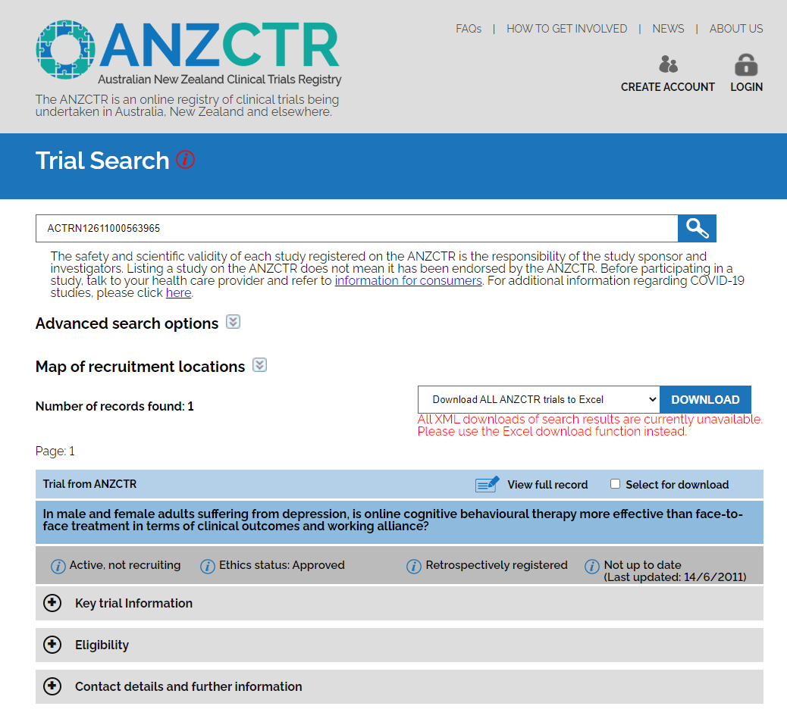
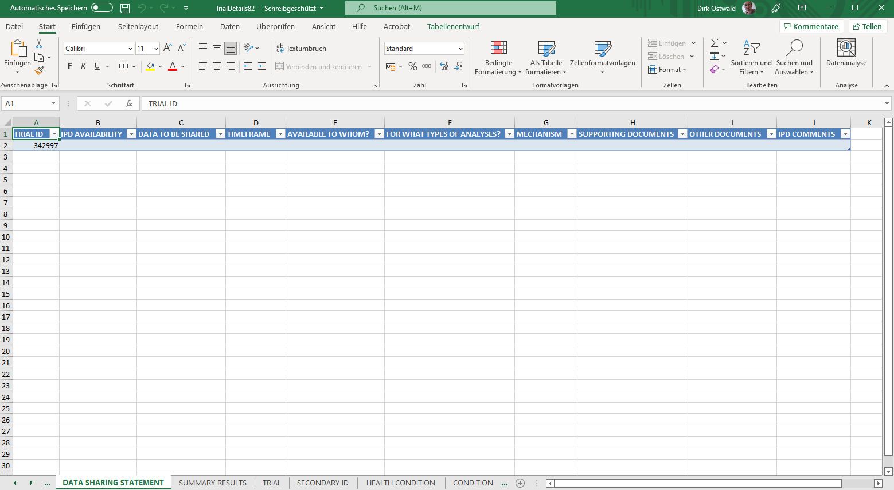
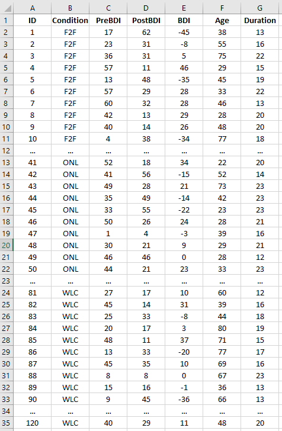

```{r, include = F}
source("8_R_common.R")
fdir        = file.path(getwd(), "8_Abbildungen")                                # Abbildungsverzeichnis
```


#  {.plain}
\center
```{r, echo = FALSE, out.width = "20%"}
knitr::include_graphics("8_Abbildungen/alm_8_otto.png")
```

\vspace{2mm}

\huge
Allgemeines Lineares Modell
\vspace{6mm}

\large
BSc Psychologie SoSe 2022

\vspace{6mm}
\normalsize
Prof. Dr. Dirk Ostwald

#  {.plain}
\center
\huge
\vfill
\noindent (8) Studiendesign
\vfill

# Überblick
\small
\center
\footnotesize
\renewcommand{\arraystretch}{1.1}
\begin{tabular}{lll}
Datum        & Einheit                       & Thema					                          \\\hline
08.04.2022   & Grundlagen                    & (1) Regression  				                  \\
             & \textcolor{gray}{Osterpause}                                             \\
22.04.2022   & Grundlagen                    & (2) Korrelation               	          \\
29.04.2022   & Grundlagen                    & (3) Matrizen                             \\
06.05.2022   & Grundlagen                    & (4) Normalverteilungen                   \\
13.05.2022   & Theorie                       & (5) Modellformulierung                   \\
20.05.2022   & Theorie                       & (6) Modellschätzung                      \\
27.05.2022   & Theorie                       & (7) Modellevaluation                     \\
03.06.2021   & Anwendung                     & (8) Studiendesign                        \\
10.06.2021   & Anwendung                     & (9) T-Tests                              \\
17.06.2021   & Anwendung                     & (10) Einfaktorielle Varianzanalyse       \\
24.06.2022   & Anwendung                     & (11) Zweifaktorielle Varianzanalyse      \\
01.07.2022   & Anwendung                     & (12) Multiple Regression                 \\
08.07.2022   & Anwendung                     & (13) Kovarianzanalyse                    \\\hline
14.07.2022   & Klausurtermin                 &                                          \\
März 2023    & Klausurwiederholungstermin    &
\end{tabular}


# Überblick
\setstretch{3}

Studiendesign

* Einführung in die grundlegende Nomenklatur des Studiendesigns

* Grundlegende Logik experimenteller Kontrolle durch Subtraktion

* Grundlegende Logik faktorieller Studiendesigns

* Anwendungsbeispiel für ALM Designs im weiteren Kursverlauf


#  {.plain}
\vfill
\large
\setstretch{2.5}
Grundbegriffe

Randomisierte einfaktorielle Studiendesigns

Randomisierte mehrfaktorielle Studiendesigns

Anwendungskontext

Anwendungsbeispiel

Selbstkontrollfragen
\vfill

#  {.plain}
\vfill
\large
\setstretch{2.5}
**Grundbegriffe**

Randomisierte einfaktorielle Studiendesigns

Randomisierte mehrfaktorielle Studiendesigns

Anwendungskontext

Anwendungsbeispiel

Selbstkontrollfragen
\vfill


# Grundbegriffe
\large
\textcolor{darkblue}{Empirische Studie}
\normalsize

Eine \textcolor{darkblue}{empirische Studie} ist gekennzeichnet durch systematische
Datenerhebung und/oder Datenanalyse und dient der vorläufigen Beantwortung inhaltlicher
Forschungsfragen. Im Rahmen quantitativer empirischen Studien werden Aspekte der
Wirklichkeit variiert und gemessen und so als Werte von \textcolor{darkblue}{Variablen}
repräsentiert.

\vspace{2mm}

Weitere wichtige und wertvolle Studientypen sind zum Beispiel
\textcolor{darkblue}{theoretische Studien}, die der Weiterentwicklung
von wissenschaftlichen Theorien und Modellen dienen, und
\textcolor{darkblue}{Methodenstudien}, die der Weiterentwicklung der
wissenschaftlichen Methoden dienen.


# Grundbegriffe
\setstretch{1.6}
\textcolor{darkblue}{Konzeptuelle Variablentypen und Experimentelle Einheiten}

\small
\textcolor{darkblue}{Unabhängige Variable (UV)}

Etwas, das in einer Studie variiert wird, um seine Auswirkung auf abhängige Variablen zu studieren.

\textcolor{darkblue}{Abhängige Variable (AV)}

Etwas, das in einer Studie erfasst wird, um die Auswirkungen der unabhängigen Variablen zu studieren.

\textcolor{darkblue}{Experimentelle Einheit (EE)}

Etwas, das der AV ausgesetzt wird und an dem die UV bestimmt wird.

\textcolor{darkblue}{Beispiele}

\footnotesize
* Einfluss von Psychotherapie Setting (UV) auf Symptomreduktion (AV) bei Patient:innen (EE)
* Einfluss von COVID-19 Impfstofftypen (UV) auf Antikörperlevel (AV) bei Mäusen (EE)
* Einfluss von Düngemitteln (UV) auf Getreidewachstum (AV) auf Versuchsäckern (EE) ([Rothamsted Research](https://en.wikipedia.org/wiki/Rothamsted_Research))


# Grundbegriffe
\textcolor{darkblue}{Numerische Variablentypen}
\small

\textcolor{darkblue}{Diskrete Variablen}

Diskrete (kategoriale) Variablen sind Variablen, die nur eine endliche Anzahl
an verschiedenen Werten annehmen und meist durch ganze Zahlen repräsentiert sind.
\vspace{3mm}

\textcolor{darkblue}{Kontinuierliche Variablen}

Kontinuierliche Variablen sind Variablen, die unendlich viele Werte annehmen
können und meist durch die reellen Zahlen repräsentiert sind.
\vspace{3mm}

\textcolor{darkblue}{Einordnung einer Variable als diskret oder kontinuierlich ist eine Modellierungsannahme}

\center
\begin{tabular}{ll}
Geschlecht        & m/w vs. m/w/d vs. Kontinuum                       \\
Alter             & Zeit als reelle Zahl vs. 20, 21, 22, ..., 100      \\
Reaktionszeiten   & Zeit als reelle Zahl vs. floating point numbers
\end{tabular}


# Grundbegriffe
\setstretch{1.6}
\textcolor{darkblue}{Allgemeine Systematik von Studiendesigns}
\small

\textcolor{darkblue}{Randomisierte kontrollierte Studie (Experiment)}

* Die Untersuchungseinheiten werden den Versuchsbedingungen zufällig zugeordnet
* Beispiel: Online Psychotherapie vs. Klassische Psychotherapie bei Depression

\vspace{1mm}
\textcolor{darkblue}{Nicht-randomisierte kontrollierte Studie (Quasiexperiment)}

* Untersuchung natürlich bzw. bereits bestehender Gruppen
* Beispiel: Online Psychotherapie bei Depression vs. Schizophrenie

\vspace{1mm}
\textcolor{darkblue}{Analyse eines bestehenden Datensatzes (Korrelationstudie)}

* Nicht-randomisierte, nicht kontrollierte Studie
* Beobachtungsstudie ohne Intervention
* Beispiel: Analyse von Paneldaten


# Grundbegriffe
\setstretch{3}
\textcolor{darkblue}{Charakteristika randomisierter kontrollierter Studien}

* Vorhandensein einer kausaltheoretischen Hypothese vor Versuchsbeginn
* Gute Manipulierbarkeit von unabhängigen Variablen
* Explizite Operationalisierung des untersuchter Konstrukte
* Kontrollierbarkeit möglichst vieler Versuchsbedingungen
* Typisch für bereits gut erschlossene Gegenstandsbereiche


# Grundbegriffe
\setstretch{2.2}

\textcolor{darkblue}{Faktorielle Studiendesigns}

* Kategoriale unabhängige Variable
* Die Werte der unabhängigen Variablen werden Level genannt
* Einfaktorielle oder mehrfaktoriell

\textcolor{darkblue}{Parametrische Studiendesigns}

* Kontinuierliche unabhängige Variable
* Die Werte der unabhängigen Variablen werden oft Level genannt
* Meist einfaktoriell

# Grundbegriffe
\setstretch{1.5}
\textcolor{darkblue}{Between-Group Designs | Studiendesigns mit Randomisierug}

* \small Gesamtgruppe wird zufällig auf experimentelle Bedingungen aufgeteilt
* Einfaktoriell, mehrfaktoriell
* Häufig in der klinischen Forschung verwendet

\textcolor{darkblue}{Within-Group Designs | Studiendesigns mit Wiederholungsmessung}

* \small Eine Gesamtgruppe wird sämtlichen experimentellen Bedingungen unterzogen
* Einfaktoriell, mehrfaktoriell, parametrisch
* Häufig in der psychologischen Grundlagenforschung verwendet

\textcolor{darkblue}{Block Designs | Studiendesigns mit parallelisierten Gruppen}

* \small Gesamtgruppe wird gesteuert auf experimentelle Bedingungen aufgeteilt
* Experimentelle Gruppen werden anhand bestimmter Merkmale parallelisiert
* Häufiger in der klinischen Forschung verwendet

\textcolor{darkblue}{Mixed Designs | Mischdesigns}

* \small Mischungen aller obiger Versuchsplantypen

# Grundbegriffe

\textcolor{darkblue}{Randomisierung bei Between-Group Designs}
\vfill
```{r, echo = FALSE, out.width = "85%"}
knitr::include_graphics("8_Abbildungen/alm_8_randomisierung.pdf")
```
\vfill

# Grundbegriffe
\setstretch{1.5}

\textcolor{darkblue}{Designschemata}

* R: Randomisierung
* O: Observation (Test, Messung)
* X: Exposition experimenteller Bedingung
* Experimentelle Bedingungen von oben nach unten
* Zeitliche Abfolge von links nach rechts

\vspace{1mm}
\textcolor{darkblue}{Beispiel}

\center
\begin{tabular}{|ccc|}
\hline
$\quad$R$\quad$  & $\quad$X$\quad$ & $\quad$O$\quad$
\\
$\quad$R$\quad$  & $\quad$ $\quad$ & $\quad$O$\quad$
\\\hline
\end{tabular}
\vspace{2mm}

* \small Bedingungszuweisung erfolgt durch Randomisierung
* Nur eine Gruppe erhält das Treatment
* Beide Gruppen absolvieren die Messung

#  {.plain}
\vfill
\large
\setstretch{2.5}
Grundbegriffe

**Randomisierte einfaktorielle Studiendesigns**

Randomisierte mehrfaktorielle Studiendesigns

Anwendungskontext

Anwendungsbeispiel

Selbstkontrollfragen
\vfill


# Randomisierte einfaktorielle Studiendesigns
\setstretch{1.8}
\textcolor{darkblue}{Randomisierte einfaktorielle Studiendesigns}

* Gesamtgruppe wird zufällig auf experimentelle Bedingungen aufgeteilt
* Eine unabhängige Variable mit zwei oder mehr Leveln
* Populäres Designs in der klinischen Forschung
* Varianten
\begin{itemize}
\item[o] Treatment- und Kontrollgruppe
\item[o] Treatment- und Placebogruppe
\item[o] Zwei Treatmentgruppen (und Kontrollgruppe)
\item[o] Pretest-Posttest Designs
\end{itemize}

# Randomisierte einfaktorielle Studiendesigns

\setstretch{2}
\large
\textcolor{darkblue}{No-Treatment Kontrollgruppe}
\vspace{4mm}

\center
\begin{tabular}{|ccc|}
\hline
$\quad$R$\quad$  & $\quad$X$\quad$ & $\quad$O$\quad$
\\
$\quad$R$\quad$  & $\quad$ $\quad$ & $\quad$O$\quad$
\\\hline
\end{tabular}
\vspace{2mm}

\normalsize
* Vergleich eines Treatments zu keinem Treatment

# Randomisierte einfaktorielle Studiendesigns

\setstretch{2}
\large
\textcolor{darkblue}{Placebo Kontrollgruppe}
\vspace{6mm}

\large
\center
\begin{tabular}{|clc|}
\hline
$\quad$R$\quad$  & $\quad$X     $\quad$ & $\quad$O$\quad$
\\
$\quad$R$\quad$  & $\quad$X$_P$ $\quad$ & $\quad$O$\quad$
\\\hline
\end{tabular}
\vspace{6mm}

\normalsize
* Placebo = Scheintreatment
* Vergleich eines Treatments zu keinem Treatment
* Kontrolle studieninduzierter Effekte (Placeboeffekte)


# Randomisierte einfaktorielle Studiendesigns
\setstretch{2}
\large
\textcolor{darkblue}{Vergleich zweier Treatments}
\vspace{6mm}

\large
\center
\begin{tabular}{|clc|}
\hline
$\quad$R$\quad$  & $\quad$X$_A$ $\quad$ & $\quad$O$\quad$
\\
$\quad$R$\quad$  & $\quad$X$_B$ $\quad$ & $\quad$O$\quad$
\\\hline
\end{tabular}
\vspace{6mm}

\normalsize
* Vergleich Standardtreatment A und neues Treatment B
* Keine Aussage über Effektivität des Standardtreatments


# Randomisierte einfaktorielle Studiendesigns
\large
\textcolor{darkblue}{Zwei-Treatment Vergleich mit Placebo-Kontrollgruppe}
\vspace{4mm}

\center
\begin{tabular}{|clc|}
\hline
$\quad$R$\quad$  & $\quad$X$_A$ $\quad$ & $\quad$O$\quad$
\\
$\quad$R$\quad$  & $\quad$X$_B$ $\quad$ & $\quad$O$\quad$
\\
$\quad$R$\quad$  & $\quad$X$_P$ $\quad$ & $\quad$O$\quad$
\\\hline
\end{tabular}
\vspace{2mm}

\normalsize
* Vergleich Standardtreatment A und neues Treatment B
* Aussage über Effektivität des Standardtreatments möglich
* Placebotreatment kann ethisch nicht vertretbar sein

\small
\flushleft
Beispiel: Einfluss von Psychotherapie auf Depressionssymptomatik

* Klassische Psychotherapie (A)
* Online Psychotherapie (B)
* Seelsorge (P)

\normalsize
\textcolor{darkblue}{$\quad\quad\rightarrow$ Keine Aussagen über Pre-Treatment Gruppenunterschiede möglich}

\textcolor{darkblue}{$\quad\quad\rightarrow$ Keine Aussage über Dropout Charakteristika möglich}

# Randomisierte einfaktorielle Studiendesigns
\large
\setstretch{2}
\textcolor{darkblue}{Pre-Posttest Designs}
\vspace{4mm}

\center
\begin{tabular}{|cclc|}
\hline
$\quad$R$\quad$ & $\quad$O$\quad$ & $\quad$X$_A$ $\quad$ & $\quad$O$\quad$
\\
$\quad$R$\quad$ & $\quad$O$\quad$ & $\quad$X$_B$ $\quad$ & $\quad$O$\quad$
\\
$\quad$R$\quad$ & $\quad$O$\quad$ & $\quad$      $\quad$ & $\quad$O$\quad$
\\\hline
\end{tabular}
\vspace{6mm}

\normalsize
* Fokus auf Treatment-induzierte Verbesserungen/Verschlechterungen
* Subtraktion von Pre-Test-Gruppenunterschieden möglich
* Untersuchung von Dropout Charakteristika möglich
* Mögliches Auftreten von Testeffekten (Lernen, Gewöhnung, Ermüdung)
* Höherer Zeit- und Kostenaufwand

# Randomisierte einfaktorielle Studiendesigns

\textcolor{darkblue}{Beispiel: Evaluation von Psychotherapieformen bei Depression}
\vspace{2mm}


```{r, echo = FALSE, out.width = "90%"}
knitr::include_graphics("8_Abbildungen/alm_8_messplan.pdf")
```

\large
\center
$\Rightarrow$ Randomisiertes einfaktorielles Preposttest Design ohne Kontrollgruppe


#  {.plain}
\vfill
\large
\setstretch{2.5}
Grundbegriffe

Randomisierte einfaktorielle Studiendesigns

**Randomisierte mehrfaktorielle Studiendesigns**

Anwendungskontext

Anwendungsbeispiel

Selbstkontrollfragen
\vfill


# Randomisierte mehrfaktorielle Studiendesigns
\setstretch{2}
\textcolor{darkblue}{Mehrfaktorielle Studiendesigns}

* Kombination mehrerer experimenteller Faktoren in einem Versuchsplan

\textcolor{darkblue}{Crossed Design}

* Jedes Level jedes Faktors wird mit allen Leveln aller Faktoren kombiniert.

\textcolor{darkblue}{Nested Design}

* Einige Level eines Faktors werden nicht mit allen anderen Faktorleveln kombiniert.

\center
\textcolor{darkblue}{$\Rightarrow$ Prototypisch sind zweifaktorielle Studiendesigns mit crossed design}


# Randomisierte mehrfaktorielle Studiendesigns
\setstretch{1.4}
\textcolor{darkblue}{Randomisiertes zweifaktorieller Studiendesigns mit crossed design}

\small
* Eine univariate abhängige Variable bestimmt an individuellen experimentellen Einheiten.
* Zwei diskrete unabhängige Variablen, die mindestens zweistufig sind.
* Die unabhängigen Variablen werden \textit{Faktoren} genannt.
* Die Stufen der Faktoren werden \textit{Level} genannt.
* Jedes Level eines Faktors wird mit allen Level des anderen Faktors kombiniert

\normalsize
\textcolor{darkblue}{Zweifaktorielle Studiendesigns werden üblicherweise anhand ihrer Faktorlevel bezeichnet}

\small
\begin{center}
\begin{tabular}{lll}
2 x 2 Design: Faktor A mit Level 1,2     & Faktor B mit Level 1,2       \\
2 x 3 Design: Faktor A mit Level 1,2     & Faktor B mit Level 1,2,3     \\
4 x 2 Design: Faktor A mit Level 1,2,3,4 & Faktor B mit Level 1,2       \\
3 x 1 Design: Faktor A mit Level 1,2,3   & Faktor B mit Level 1
\end{tabular}
\end{center}

* 2 x 2 Studiendesigns sind sehr populär, wir fokussieren auf diesen Fall.

\normalsize
$\Rightarrow$ Das entsprechende datenanalytische Verfahren ist die Varianzanalyse (ANOVA)


# Randomisierte mehrfaktorielle Studiendesigns
\textcolor{darkblue}{Konzeptuelles Design eines 2 x 2 Versuchsplans}

```{r, echo = FALSE, out.width = "65%"}
knitr::include_graphics("8_Abbildungen/alm_8_zweifaktorielle_va_nomenklatur.pdf")
```

# Randomisierte mehrfaktorielle Studiendesigns

\textcolor{darkblue}{Anwendungsbeispiel eines randomisierten 2 x 2 Versuchsplans}
\small
\setstretch{1.6}

* Ist Psychotherapie bei Depression im klassischen oder im online Setting wirksamer?
* Ist Psychotherapie bei bei Depression bei jüngeren oder älterne Patient:innen wirksamer?

```{r, echo = FALSE, out.width = "50%"}
knitr::include_graphics("8_Abbildungen/alm_8_zweifaktorielle_va_beispiel.pdf")
```


* Ist die Wirksamkeit der Psychotherapie vom Setting abhängig?
* Ist die Wirksamkeit der Psychotherapie vom Alter der Patient:innen abhängig?


# Randomisierte mehrfaktorielle Studiendesigns
\textcolor{darkblue}{Verlaufsschema eines randomisierten 2 x 2 Versuchsplans}
\vspace{1cm}

\center
\large
\begin{tabular}{|clc|}
\hline
$\quad$R$\quad$  & $\quad$X$_{A1B1}$ $\quad$ & $\quad$O$\quad$
\\
$\quad$R$\quad$  & $\quad$X$_{A1B2}$ $\quad$ & $\quad$O$\quad$
\\
$\quad$R$\quad$  & $\quad$X$_{A2B1}$ $\quad$ & $\quad$O$\quad$
\\
$\quad$R$\quad$  & $\quad$X$_{A2B2}$ $\quad$ & $\quad$O$\quad$
\\\hline
\end{tabular}
\vspace{1cm}

\normalsize
\setstretch{2}
* Pre-Posttest Designs möglich
* Placebo Kontrollgruppen möglich


# Randomisierte mehrfaktorielle Studiendesigns
\textcolor{darkblue}{Daten bei 2 x 2 Studiendesignsn}

```{r, echo = FALSE, out.width = "70%"}
knitr::include_graphics("8_Abbildungen/alm_8_zweifaktorielle_va_konzept.pdf")
```


# Randomisierte mehrfaktorielle Studiendesigns
\textcolor{darkblue}{Haupteffekte und Interaktionen}

\footnotesize
\justifying
Hinsichtlich der Gruppenmittelwerte bei 2 x 2 Studiendesignsn unterscheidet man **Haupteffekte** und **Interaktionen**

* Intuitiv spricht man vom Vorliegen eines \textit{Haupteffekts von Faktor A},
wenn sich die Gruppenmittelwerte zwischen Level 1 und Level 2 von Faktor A,
jeweils gemittelt über die zwei Level von Faktor B, unterscheiden.

* Intuitiv spricht man vom Vorliegen eines \textit{Haupteffekts von Faktor B},
wenn sich die Gruppenmittelwerte zwischen Level 1 und Level 2 von Faktor B,
jeweils gemittelt über die zwei Level von Faktor A, unterscheiden.

*  Intuitiv spricht man vom Vorliegen einer \textit{Interaktion der Faktoren A
und B}, wenn der Unterschied der Gruppenmittelwerte von Faktor A zwischen Level 1 und
2 unterschiedlich für Level 1 und Level 2 von Faktor B ausgeprägt ist bzw. wenn
der Unterschied der Gruppenmittelwerte von Faktor B zwischen Level 1 und
2 unterschiedlich für Level 1 und Level 2 von Faktor A ausgeprägt ist.

Intuitiv beziehen sich Haupteffekte also auf (marginale) Unterschiede (Differenzen),
während sich Interaktionen auf Unterschiede von Unterschieden (Differenzen von
Differenzen) beziehen.

Das Vorhandensein einer Interaktion besagt lediglich, dass sich die Unterschiede
der Gruppenmittelwerte zwischen den Leveln eines experimentellen Faktors in Abhängigkeit
von den Leveln des anderen experimentellen Faktors ändern, es macht aber keine
Aussage darüber, warum dies so ist. Haupteffekte und Interaktionen sind lediglich
Datenmuster, keine mechanistischen wissenschaftlichen Theorien.


#  {.plain}
\vfill
\large
\setstretch{2.5}
Grundbegriffe

Randomisierte einfaktorielle Studiendesigns

Randomisierte mehrfaktorielle Studiendesigns

**Anwendungskontext**

Anwendungsbeispiel

Selbstkontrollfragen
\vfill


# Anwendungskontext
\textcolor{darkblue}{Evidenzbasierte Evaluation von Psychotherapieformen bei Depression}

\normalsize
Welche Therapieform ist bei Depression wirksamer?

```{r, echo = FALSE, out.width = "110%"}
knitr::include_graphics("8_Abbildungen/alm_8_klinische_forschung.pdf")
```

$\rightarrow$ Klinische Psychologie, Klinische Diagnostik, MSc Psychotherapie

\footnotesize
\flushright
*Wahrscheinlichkeitstheorie und Frequentistische Inferenz WiSe 21/22 (1) Einführung*

# Anwendungskontext
\textcolor{darkblue}{Evidenzbasierte Evaluation von Psychotherapieformen bei Depression}

\normalsize
Becks Depressions-Inventar (BDI) zur Depressionsdiagnostik

```{r, echo = FALSE, out.width = "95%"}
knitr::include_graphics("8_Abbildungen/alm_8_bdi.pdf")
```
\footnotesize
\flushright
*Wahrscheinlichkeitstheorie und Frequentistische Inferenz WiSe 21/22 (1) Einführung*


# Anwendungskontext
\textcolor{darkblue}{Evidenzbasierte Evaluation von Psychotherapieformen bei Depression - Verhaltensdaten}

\footnotesize
```{r, echo = F}
# simulation parameters
n          = 16                            # number of patients
cond       = c("Online", "Klassisch")      # experimental conditions
bdi_prae   = 15:50                         # prae PT BDI Score Range
bdi_pos    = 10:30                         # post PT BDI Score Range

# data simulation
D = data.frame(1:n,
               sample(cond     , n, replace = TRUE),
               sample(bdi_prae , n, replace = TRUE),
               sample(bdi_pos  , n, replace = TRUE))

# table visualization
knitr::kable(D,
             col.names  = c("Patient ID", "Bedingung", "Prae-PT-BDI", "Post-PT-BDI"),
             align      = "cccc",
             "pipe")
```

\footnotesize
\flushright
*Wahrscheinlichkeitstheorie und Frequentistische Inferenz WiSe 21/22 (1) Einführung*

# Anwendungskontext {.t}
```{r, echo = FALSE, out.width = "65%"}
knitr::include_graphics("8_Abbildungen/alm_8_review_title.pdf")
```
\center
\textcolor{darkblue}{Abstract}
```{r, echo = FALSE, out.width = "65%"}
knitr::include_graphics("8_Abbildungen/alm_8_review_abstract.pdf")
```
\flushright
\footnotesize
*@moshe_2021*

# Anwendungskontext {.t}
```{r, echo = FALSE, out.width = "70%"}
knitr::include_graphics("8_Abbildungen/alm_8_review_title.pdf")
```
\center
\textcolor{darkblue}{Results}
```{r, echo = FALSE, out.width = "50%"}
knitr::include_graphics("8_Abbildungen/alm_8_review_results.pdf")
```
\flushright
\footnotesize
*@moshe_2021*

# Anwendungskontext {.t}
```{r, echo = FALSE, out.width = "70%"}
knitr::include_graphics("8_Abbildungen/alm_8_review_title.pdf")
```
\center
\textcolor{darkblue}{Discussion}
```{r, echo = FALSE, out.width = "50%"}
knitr::include_graphics("8_Abbildungen/alm_8_review_discussion.pdf")
```
\flushright
\footnotesize
*@moshe_2021*

# Anwendungskontext {.t}
```{r, echo = FALSE, out.width = "50%"}
knitr::include_graphics("8_Abbildungen/alm_8_article_title.pdf")
```
\center
\textcolor{darkblue}{Abstract}
```{r, echo = FALSE, out.width = "70%"}
knitr::include_graphics("8_Abbildungen/alm_8_article_abstract.pdf")
```
\flushright
\footnotesize
*@wagner_2014*

# Anwendungskontext {.t}
```{r, echo = FALSE, out.width = "50%"}
knitr::include_graphics("8_Abbildungen/alm_8_article_title.pdf")
```
\center
\textcolor{darkblue}{Participants}
```{r, echo = FALSE, out.width = "50%"}
knitr::include_graphics("8_Abbildungen/alm_8_article_participants.pdf")
```
\flushright
\footnotesize
*@wagner_2014*

# Anwendungskontext {.t}
```{r, echo = FALSE, out.width = "50%"}
knitr::include_graphics("8_Abbildungen/alm_8_article_title.pdf")
```
\center
\textcolor{darkblue}{Demographics}
```{r, echo = FALSE, out.width = "70%"}
knitr::include_graphics("8_Abbildungen/alm_8_article_demographics.pdf")
```
\flushright
\footnotesize
*@wagner_2014*

# Anwendungskontext {.t}
```{r, echo = FALSE, out.width = "50%"}
knitr::include_graphics("8_Abbildungen/alm_8_article_title.pdf")
```
\center
\textcolor{darkblue}{Procedure}
```{r, echo = FALSE, out.width = "50%"}
knitr::include_graphics("8_Abbildungen/alm_8_article_procedure_1.pdf")
```
\vspace{-3mm}
```{r, echo = FALSE, out.width = "49%"}
knitr::include_graphics("8_Abbildungen/alm_8_article_procedure_2.pdf")
```
\vfill
\flushright
\footnotesize
*@wagner_2014*

# Anwendungskontext {.t}
```{r, echo = FALSE, out.width = "50%"}
knitr::include_graphics("8_Abbildungen/alm_8_article_title.pdf")
```
\center
\textcolor{darkblue}{Interventions}
```{r, echo = FALSE, out.width = "30%"}
knitr::include_graphics("8_Abbildungen/alm_8_article_intervention_1.pdf")
```
\vspace{-2mm}
```{r, echo = FALSE, out.width = "30%"}
knitr::include_graphics("8_Abbildungen/alm_8_article_intervention_2.pdf")
```
\vspace{-2mm}
```{r, echo = FALSE, out.width = "30%"}
knitr::include_graphics("8_Abbildungen/alm_8_article_intervention_3.pdf")
```
\flushright
\footnotesize
*@wagner_2014*

# Anwendungskontext {.t}
```{r, echo = FALSE, out.width = "50%"}
knitr::include_graphics("8_Abbildungen/alm_8_article_title.pdf")
```
\center
\textcolor{darkblue}{Outcome measure (Abhängige Variable)}
```{r, echo = FALSE, out.width = "50%"}
knitr::include_graphics("8_Abbildungen/alm_8_article_outcome_measures.pdf")
```
\flushright
\footnotesize
*@wagner_2014*

# Anwendungskontext {.t}
```{r, echo = FALSE, out.width = "50%"}
knitr::include_graphics("8_Abbildungen/alm_8_article_title.pdf")
```
\center
\textcolor{darkblue}{Results}
```{r, echo = FALSE, out.width = "55%"}
knitr::include_graphics("8_Abbildungen/alm_8_article_results.pdf")
```
\flushright
\footnotesize
*@wagner_2014*

# Anwendungskontext {.t}
```{r, echo = FALSE, out.width = "50%"}
knitr::include_graphics("8_Abbildungen/alm_8_article_title.pdf")
```
\center
\textcolor{darkblue}{Discussion}
```{r, echo = FALSE, out.width = "50%"}
knitr::include_graphics("8_Abbildungen/alm_8_article_discussion.pdf")
```
\flushright
\footnotesize
*@wagner_2014*

# Anwendungskontext {.t}
```{r, echo = FALSE, out.width = "50%"}
knitr::include_graphics("8_Abbildungen/alm_8_article_title.pdf")
```
\center
\textcolor{darkblue}{Conclusion}
\vspace{5mm}
```{r, echo = FALSE, out.width = "50%"}
knitr::include_graphics("8_Abbildungen/alm_8_article_conclusion.pdf")
```
\vfill
\flushright
\footnotesize
*@wagner_2014*

# Anwendungskontext {.t}
```{r, echo = FALSE, out.width = "50%"}
knitr::include_graphics("8_Abbildungen/alm_8_article_title.pdf")
```
```{r, echo = FALSE, out.width = "65%"}

```

# Anwendungskontext {.t}
```{r, echo = FALSE, out.width = "50%"}
knitr::include_graphics("8_Abbildungen/alm_8_article_title.pdf")
```
\vspace{2mm}
```{r, echo = FALSE, out.width = "50%"}

```

# Anwendungskontext {.t}
```{r, echo = FALSE, out.width = "50%"}
knitr::include_graphics("8_Abbildungen/alm_8_article_title.pdf")
```
\vspace{2mm}
```{r, echo = FALSE, out.width = "80%"}

```

#  {.plain}
\vfill
\large
\setstretch{2.5}
Grundbegriffe

Randomisierte einfaktorielle Studiendesigns

Randomisierte mehrfaktorielle Studiendesigns

Anwendungskontext

**Anwendungsbeispiel**

Selbstkontrollfragen
\vfill


# Anwendungsbeispiel

```{r, echo = FALSE, out.width = "100%"}
knitr::include_graphics("8_Abbildungen/alm_8_modellstudie.pdf")
```


# Anwendungsbeispiel
\normalsize
\textcolor{darkblue}{Experimentelle Einheiten}

\small
Randomisierte Zuordnung von Patient:innen zu den experimentellen Gruppen

$\bullet$ Unabhängig und identisch verteilte Fehlervariablen

\normalsize
\textcolor{darkblue}{Abhängige Variable}

\small
Negative Post-BDI vs. Prä-BDI Differenz

$\bullet$ Univariate abhängige Variable $\Leftrightarrow$ Ein Wert pro Patient:in

$\bullet$ Positive Werte $\,\,\Leftrightarrow$ Verringerung der Depressionssymptomatik

$\bullet$ Negative Werte $\Leftrightarrow$ Verstärkung der Depressionssymptomatik


\normalsize
\textcolor{darkblue}{Unabhängige Variablen}

\small
Experimentelle Gruppen $\Leftrightarrow$ Psychotherapie Setting

$\bullet$ Face-to-face (F2F), Online (ONL), Waitlist Control (WLC)

Patient:innen Alter in Jahren

Anzahl Therapiestunden


# Anwendungsbeispiel {.t}
```{r, echo = F, eval = F}
# Initialisierung
library(writexl)                                                                 # Excel Output
set.seed(1)                                                                      # seed


# Simulationsparameter
n_c    = 3                                                                       # Anzahl Gruppen
n_i    = 40                                                                      # Anzahl Proband:innen pro Gruppe
n      = n_c*n_i                                                                 # Gesamtanzahl
pre    = round(runif(n,0,63))                                                    # Uniform verteilte Pre-BDI Werte
pos    = round(runif(n,0,63))                                                    # Uniform verteilte Post-BDI Werte
dif    = pre - pos                                                               # Uniform verteilte Post-BDI - Pre-BDI Werte


# Datensimulation 
D            = data.frame(
               c(1:(n_c*n_i)),                                                    # ID Nummer
               c(rep("F2F", n_i), rep("ONL", n_i), rep("WLC", n_i)),             # Gruppenzugehörigkeit/Bedingung
               pre,                                                              # Pre-BDI Werte
               pos,                                                              # Post-BDI Werte
               dif,                                                              # BDI Differenzwerte
               round(runif(n,20,80)),                                            # Uniform verteilte Alterswerte
               round(runif(n,12,24)))                                            # Uniform Therapiedauerwerte
            
colnames(D)  = c("ID",
                 "Condition",
                 "PreBDI",
                 "PostBDI",
                 "BDI",
                 "Age",
                 "Duration")

# Datenspeicherung
write_xlsx(D, file.path(getwd()       , "8_Daten", "data.xlsx"))
write.csv( D, file = file.path(getwd(), "8_Daten", "data.csv"))
```

\center
\textcolor{darkblue}{Beispieldatensatz}
```{r, echo = FALSE, out.width = "40%"}

```


#  {.plain}
\vfill
\large
\setstretch{2.5}
Grundbegriffe

Randomisierte einfaktorielle Studiendesigns

Randomisierte mehrfaktorielle Studiendesigns

Anwendungskontext

Anwendungsbeispiel

**Selbstkontrollfragen**
\vfill

# Selbstkontrollfragen
\footnotesize
\setstretch{1.6}
1. Erläutern Sie die Begriffe der empirischen Studie, der theoretischen Studie, und der Methodenstudie.
2. Erläutern Sie die Begriffe der unabhängigen Variable, der abhängigen Variable, und der experimentellen Einheit.
3. Erläutern Sie die Begriffe der diskreten Variable und der kontinuierlichen Variable.
4. Erläutern Sie die Begriffe der randomisierten und der nicht-randomisierten kontrollierten Studie.
5. Erläutern Sie die Begriffe des Quasiexperiments und der Korrelationsstudie.
6. Nennen Sie drei Charakteristika randomisierter kontrollierter Studien.
7. Erläutern Sie die Begriffe des faktoriellen und des parametrischen Studiendesigns.
8. Erläutern Sie die Begriffe des Between-Group Designs und des Within-Group Designs.
9. Erläutern Sie die Begriffe des Studiendesigns mit Randomisierung bzw. mit Wiederholungsmessung.
10. Erläutern Sie den Begriff des randomisierten einfaktoriellen Studiendesigns.
11. Diskutieren Sie Vor- und Nachteile von No-Treatment und Placebo-Treatment Kontrollgruppen.
12. Diskutieren Sie Vor- und Nachteile von Zwei-Treatment Vergleichen ohne und mit Placebo-Kontrollgruppe.
13. Erläutern Sie Vor- und Nachteile von reinen Posttest-Designs und Pre- und Posttest Designs.
14. Erläutern Sie die Begriffe des mehrfaktoriellen Studiendesigns, des Crossed Designs, und des Nested Designs.
15. Erläutern Sie den Begriff des randomisierten zweifaktoriellen Studiendesigns mit Crossed Design.
16. Wieviele Faktoren mit jeweils wie vielen Leveln hat ein 3 x 4 x 2 Design?
17. Wieviele experimentelle Bedingungen hat ein 3 x 4 x 2 Design?
18. Erläutern Sie die Begriffe des Haupteffektes und der Interaktion am Beispiel eines 2 x 2 Studiendesigns.

# References  
\footnotesize